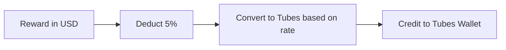

  
  
  
  

#  MEETS

##  1) Deposit

|Chain| Tokens| Credit to Local Wallet|Deposit Method|

|--|--|--|--|

| BSC| USDT (0x55d398326f99059ff775485246999027b3197955) | USDT | Normal Transfer |

  

###  Beneficiary Addresses (ETH Chain Only)

  

|  | Address |

|--|--|

| 1 | 0x5AdcD542A6fE9A4FDefb8F94c34499BDe16c025D |

| 2 | 0x181f47944C2dbA0e654C2C64Ebb95744F6d0a903 |

| 3 | 0x291Eb3Dc9F037E79FcEDfFb150f3F9b2F9729974 |

| 4 | 0x6193AD6457bFbEe04743891Cf079D1df9ED9EADc |

| 5 | 0xDC97EEA1fC085A729c65Df0D86247d3ac189a4C2 |

| 6 | 0xA28d92D6E58CD8F68Fc8f122A2ab147f96b7d404 |

| 7 | 0x6521a22e4412450924294F8a46693Ef4c7832Bf8 |

| 8 | 0xE120B29450b10098399fC0eF8f308F2723e8744e |

| 9 | 0x3015361c888490933EC7e658825cD12b99626B4C |

| 10 | 0x861553F94967360f742Cc7514dc94CE7c84b593e |

  
  
  

>  ***Note**:*

>  -  *For **ETH** chain deposit, user will direct to Deposit Page and execute deposit function, and token will directly transfer to client beneficiary wallet with round robin.*   

>-  *For **TRON & BSC** chain deposit, every user will assign one unique Deposit Address, user may directly transfer token into self deposit address.*   

  

##  2) Stakings

  

| Staking | Payment Method| Quota|

|--|--|--|
Minimum staking is $100.

  
  

>  ***Note**:*

>  -  *Current daily staking is **300 stakings (Adjustable)**.*   

>  -  *Ticket is **One-Time** usage, each ticket cost **$10**, which payable with **USDT Wallet Only**.*   

  
  

  
  

##  4) Withdrawal

  

|Chain| Wallet | Minimum Withdrawal | Charges |Withdrawal Method|

|--|--|--|--|--|

| BSC| USDT | 50 USDT | $1 | Admin Normal Transfer |
| BSC| MEETS| 50 meets | $1 | Admin Normal Transfer |
  

>  ***Note**:*

>  -  ***(USDT Only)** total withdrawal to each chain cannot exceed the total of deposits from particular chain.* 
>  -  ***(Meets Only)** total withdrawal to each chain cannot exceed the total of Meets from particular chain.*  

  

##  6) Bonuses

  

>  ***Note**:*

>  -  *Maximum cap for bonuses **(Excluded ROI, Reinvest ROI & Ticket Bonus)** is **x3.14** of self **Total Staked** in USD value. Specially **x4.13** for **TubesDAO** members.*   

  
  

###  Ranking (V0-V10)

  

Only Small Zone Sales (Exclude Big Leg) is used to calculate ranking, thus minimum 2 legs (Group) require for rank upgrade.

  

|Ranking| Small Zone Sales (USD) | Overriding Percentage |

|--|--|--|

| V1 | 2,000 | 0% |

| V2 | 5,000 | 0% |

| V3 | 10,000 | 3% |

| V4 | 50,000 | 6% |

| V5 | 100,000 | 9% |

| V6 | 300,000 | 11% |

| V7 | 500,000 | 13% |

| V8 | 1,000,000 | 14% |

| V9 | 3,000,000 | 15% |

| V10 | 10,000,000 |16% |

  

>  ***Note**:*

>  -  *User need to have minimum **staking of  $100** or buy **Nodes** to activate ranking.*  

###  Direct Sponsor Ranking (D1-V3)
|Ranking| Referral Total |  Direct Sponsor Percentage |

|--|--|--|

| D1 | 1 | 1st Level: 2% |

| D2 | 3 | 1st Level: 2%, 2nd Level: 3% |

| D3 | 5+ | 1st Level: 2%, 2nd Level: 3%, 3rd Level: 4% |

>  ***Note**:*

>  -  *User need to have minimum **staking of  $100**(included Free Staking) or buy **Nodes**(Included Free Node) to activate ranking.*  
>  
###  ROI

  

|Staking Type| ROI Percentage | Reward Start |

|--|--|--|

| Normal Staking | 1% | The next day after **success staked**  |

| Reinvest | 0.7% | The next day after **admin approval**  |

  
  

>  ***Note**:*

>  -  *There are **NO** maximum cap for ROI reward unless staking in unstaked.*   

  

###  Overriding & Matching Overriding (Same / Lower Rank)

  

Override on self's network daily ROI reward according Rank's overriding percentage

  

While distribute overriding, if upline（One Level only）is Same / Lower ranking, this upline may get 10% of reward

  

>  ***Note**:*

>  -  *Same / Lower Rank only entitle for **ONE LEVEL UPLINE** only.*   

###  Staking Direct Sponsor
###  Nodes Direct Sponsor
###  Staking Overriding
###  Nodes Overriding
###  Nodes Invest
###  Staking Invest
###  Staking Invest Overriding
