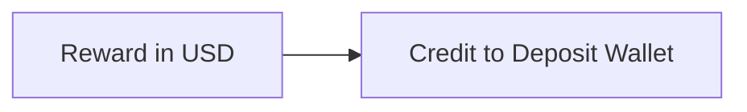
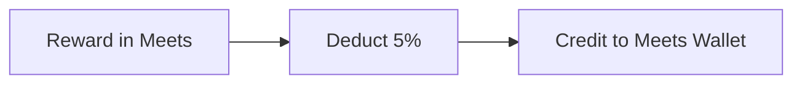

  
  
  
  

#  MEETS

##  1) Deposit

|Chain| Tokens| Credit to Local Wallet|Deposit Method|
|--|--|--|--|
| BSC| USDT (0x55d398326f99059ff775485246999027b3197955) | USDT | Normal Transfer |

  

###  Beneficiary Addresses (ETH Chain Only)

  

|  | Address |
|--|--|
| 1 | 0x5AdcD542A6fE9A4FDefb8F94c34499BDe16c025D |
| 2 | 0x181f47944C2dbA0e654C2C64Ebb95744F6d0a903 |
| 3 | 0x291Eb3Dc9F037E79FcEDfFb150f3F9b2F9729974 |
| 4 | 0x6193AD6457bFbEe04743891Cf079D1df9ED9EADc |
| 5 | 0xDC97EEA1fC085A729c65Df0D86247d3ac189a4C2 |
| 6 | 0xA28d92D6E58CD8F68Fc8f122A2ab147f96b7d404 |
| 7 | 0x6521a22e4412450924294F8a46693Ef4c7832Bf8 |
| 8 | 0xE120B29450b10098399fC0eF8f308F2723e8744e |
| 9 | 0x3015361c888490933EC7e658825cD12b99626B4C |
| 10 | 0x861553F94967360f742Cc7514dc94CE7c84b593e |
  

>  ***Note**:*

>  -  *For **ETH** chain deposit, user will direct to Deposit Page and execute deposit function, and token will directly transfer to client beneficiary wallet with round robin.*   

>-  *For **TRON & BSC** chain deposit, every user will assign one unique Deposit Address, user may directly transfer token into self deposit address.*   

  

##  2) Stakings
Minimum staking is $100.

| Staking | Payment Method |
|--|--|
| Normal Staking | - 100% USDT Wallet |
| WIth Meets Staking  | - 90% USDT Wallet   - 10%mMeets(Excahnge From USDT rate) |

>  ***Note**:*

>  -  *Only members are allowed to perform real staking, which deducts USDT. Admins do not have permission to add real staking for member.  
>   -  *Only admins are allowed to perform free staking for member. Members cannot add free staking for themselves. 

  
##  3) Nodes
Each node costs $3000, and a member can only have one node, either a free one or a purchased one.
>  ***Note**:*

>  -  *When a member buys a node, they receive 3000 in free staking. Free nodes do not include the 3000 staking.
>   -  *Once a user has a purchased or free node, they become eligible to collect the Nodes Investment bonus, calculated on the first day of each month. For example, if a user buys a node on November 8th, they qualify for the bonus when calculated on December 1st, as only 23 days have passed (less than the 30-day limit). This allows them to receive the bonus for all of December. If 30 days have passed, eligibility for the bonus depends on achieving a minimum of $5000 in small zone sales.
  

##  4) Withdrawal

  

|Chain| Wallet | Minimum Withdrawal | Charges |Withdrawal Method|
|--|--|--|--|--|
| BSC| USDT | 50 USDT | $1 | Admin Normal Transfer |
| BSC| MEETS| 50 meets | $1 | Admin Normal Transfer |
  

>  ***Note**:*

>  -  ***(USDT Only)** total withdrawal to each chain cannot exceed the total of deposits from particular chain.* 
>  -  ***(Meets Only)** total withdrawal to each chain cannot exceed the total of Meets from particular chain.*  

  

##  5) Bonuses

  ###  Reward in USDT (BCS Chain Only)

>  ***Note**:*

>  -  *Staking Direct Sponsor, Nodes Direct Sponsor, Staking Overriding and Nodes Overriding all reward in Usdt which credit to deposit wallet*
>  
###  Reward in Meets (BCS Chain Only)

>  ***Note**:*

>  -  *Nodes Invest, Staking Invest and Staking Invest Overriding all reward in Meets which credit to Meets wallet*   

###  Ranking (V0-V10) Distribute in USDT
Only Small Zone Sales (Exclude Big Leg) is used to calculate ranking, thus minimum 2 legs (Group) require for rank upgrade.
|Ranking| Small Zone Sales (USD) | Overriding Percentage |
|--|--|--|
| V1 | 2,000 | 0% |
| V2 | 5,000 | 0% |
| V3 | 10,000 | 3% |
| V4 | 50,000 | 6% |
| V5 | 100,000 | 9% |
| V6 | 300,000 | 11% |
| V7 | 500,000 | 13% |
| V8 | 1,000,000 | 14% |
| V9 | 3,000,000 | 15% |
| V10 | 10,000,000 |16% |

###  Ranking (V0-V10) Distribute in Meets
Only Small Zone Sales (Exclude Big Leg) is used to calculate ranking, thus minimum 2 legs (Group) require for rank upgrade.
|Ranking| Small Zone Sales (USD) | Overriding Percentage |
|--|--|--|
| V1 | 2,000 | 10% |
| V2 | 5,000 | 20% |
| V3 | 10,000 | 35% |
| V4 | 50,000 | 50% |
| V5 | 100,000 | 65% |
| V6 | 300,000 | 70% |
| V7 | 500,000 | 85% |
| V8 | 1,000,000 | 90% |
| V9 | 3,000,000 | 95% |
| V10 | 10,000,000 |100% |

  

>  ***Note**:*

>  -  *User need to have minimum **staking of  $100** or buy **Nodes** to activate ranking.*  
>  -  *Small zone sales are calculated based on real staking and the 3000 free staking from node purchases only* 

###  Direct Sponsor Ranking (D1-D3)
|Ranking| Referral Total |  Direct Sponsor Percentage |
|--|--|--|
| D1 | 1 | 1st Level: 2% |
| D2 | 3 | 1st Level: 2%, 2nd Level: 3% |
| D3 | 5 | 1st Level: 2%, 2nd Level: 3%, 3rd Level: 4% |

>  ***Note**:*

>  -  *User need to have minimum **staking of  $100**(included Free Staking) or buy **Nodes**(Included Free Node) to activate ranking.*  
>  
  
###  Overriding & Matching Overriding (Same / Lower Rank)

  

Override on self's network daily ROI reward according Rank's overriding percentage

  

While distribute overriding, if upline（One Level only）is Same / Lower ranking, this upline may get 10% of reward

  

>  ***Note**:*

>  -  *Same / Lower Rank only entitle for **ONE LEVEL UPLINE** only.*   

###  Bonus Type
|No| Type | Request Date | Live Date | Distribute In | Description |
|--|--|--|--|--|--|
| 1 | Staking Direct Sponsor | - | - | USDT | Bonus calculate based on staking. Can refer Direct Sponsor Ranking (D1-D3) for the distribution bonus, distribute one time only | 
| 2 | Nodes Direct Sponsor | - | - | USDT | Bonus calculate based on staking. Can refer  Direct Sponsor Ranking (D1-D3) for the distribution bonus, distribute one time only . |
| 3 | Staking Overriding | - | - | USDT | Overiding Bonus calculate based on staking and distribute bonus based on Ranking (V0-V10) Distribute in USDT, distrbute one time only |
| 4 | Nodes Overriding | - | - | USDT | Overiding Bonus calculate based on nodes and distribute bonus based on Ranking (V0-V10) Distribute in USDT, distrbute one time only |
| 5 | Nodes Invest | - | - | MEETS | - 5000 checking every month (Nodes Member)  -member who have node/free-node  -every month SMALL LEG SALE over 5000 (buy node(no buy nodes) / real staking / FreeStaking-from node.)  -check every month for next month(30days) bonus  -do a PopOut/notice for member to view their balance sale.  -if they didn’t get 5000 sale on small leg. They won’t get node bonus(roi on node) on next month .  - 5k / Total Eligible member = Per nodes user bonus |
| 6 | Staking Invest | - | - | MEETS | User A staked $1000 (1000 hash)  User B staked $100 (100 hash)   User C staked $100 (100 hash)   Total ROI hash = 1200 hash   20k / 1200 = 16.6667  Total Overriding Hash = 120 hash  So final payout will be:  User A get: 1000 x 16.6667 = 16,666.7 meets  User B get: 100 x 16.6667 = 1666.67 meets  User C get: 100 x 16.6667 = 1666.67 meets   total 20k meets|
| 7 | Staking Invest Overriding | - | - | MEETS | User D get: 100 Hash (example v1 10% of 1000hash)  User E get: 10 Hash (example v1 10% of 100hash)  User F get: 10 Hash (example v1 10% of 100hash)  Total Overriding Hash = 120 hash  20k / 120 = 166.6667  User D get: 100 x 166.6667 = 16666.67 meets  User E get: 10 x 166.6667 = 1666.667 meets  User F get: 10 x 166.6667 = 1666.667 meets   total 20k meets   -Distribute Daily, Distribute % based on Ranking (V0-V10) Distribute in Meets|
| 8 | Same Level Bonus | 21/11/2024 | 4/12/2024 | MEETS | 1.Peer-Level Reward 10%  -When the superior and subordinate are at the same level, the superior can receive 10% of the subordinate's dynamic income.   2.Cross-Level Reward 10%  -When the superior's level is lower than the subordinate's, the superior can receive 10% of the subordinate's dynamic income. |

